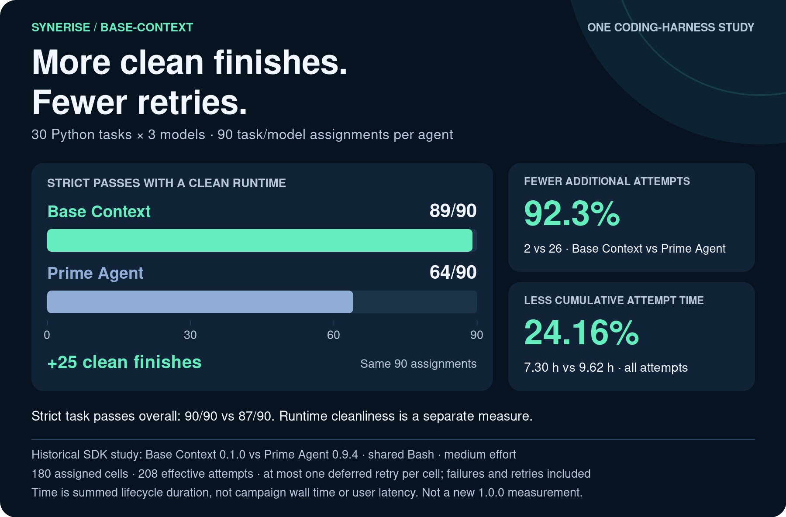
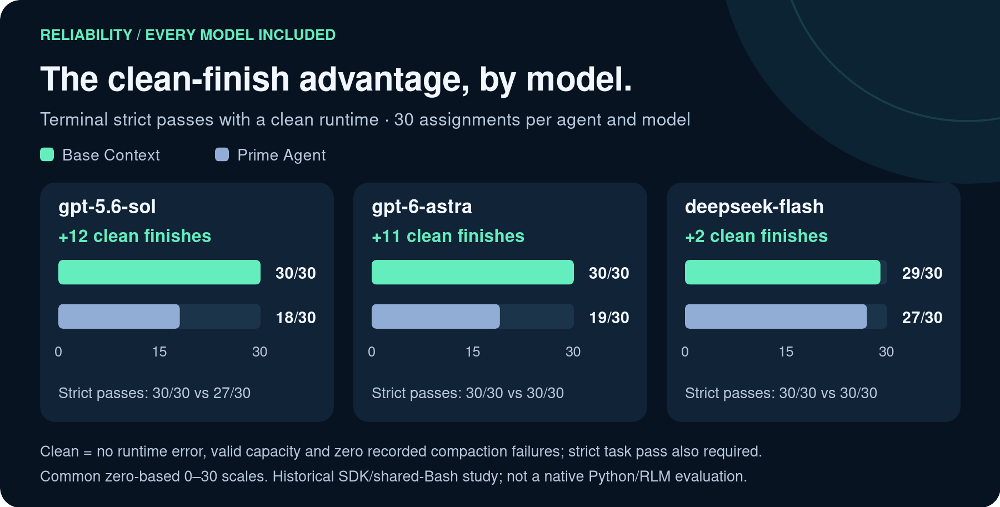
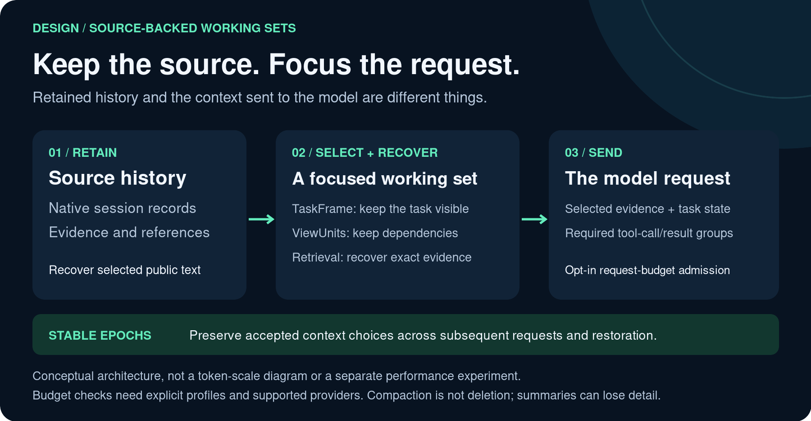

# Synerise base-context

**Keep the work. Focus the context.**

An open-source coding and research agent for work that outgrows a chat window.
Base Context combines a persistent Python workspace, recursive agents, and a source-backed context engine. It keeps retained history separate from the working set sent to the model, so long tasks can carry forward selected evidence without replaying every previous output.

Built by [Synerise](https://synerise.com), forked from [Prime Agent](https://github.com/PrimeIntellect-ai/prime-agent), and released under MIT.

[Get started](packages/coding-agent/docs/quickstart.md) · [Documentation](packages/coding-agent/docs/index.md) · [Why this fork](packages/coding-agent/docs/fork-philosophy.md) · [Benchmark report](benchmarks/python-realworld-30/REPORT.md)

[](benchmarks/python-realworld-30/REPORT.md)

*One study, not a universal ranking: historical SDK/shared-Bash results, not a fresh measurement of this release. “Clean” adds runtime requirements to task correctness. [Methodology and full results](benchmarks/python-realworld-30/REPORT.md).*

## Why Base Context?

**A capable agent is a great start. Keeping a long job coherent is the next challenge.** A task can span dozens of files, tool outputs, decisions, and interruptions. The useful question is not just “how much can the model read?” It is “can it find the right evidence and keep working?”

Base Context is built to help you:

- **Keep the thread of a long task.** Carry selected goals, constraints, and open work explicitly, rather than leave them buried in a transcript.
- **Check the evidence, not just a recollection.** Recover selected original public text from retained history when a summary is not enough.
- **Use context for the work at hand.** Bring a focused working set to the model while keeping required related messages together.
- **Keep moving after a temporary failure.** Recover recognized transient provider errors within the same invocation, without replaying completed tools, when the remaining limits allow it.

That is the bet: **less repeated detective work, more continuity, and a clearer link between what the agent says and the evidence it can recover.** The benchmark below measures one harness-level outcome; it does not prove that each mechanism independently caused the gain.

## Install (recommended)

```bash
curl -fsSL https://github.com/BaseModelAI/base-context/releases/latest/download/install.sh | bash
```

On **macOS or Linux**, this installs the **latest stable release** and its dependencies. The interactive installer asks for consent to install missing prerequisites. It supplies compatible Node.js/npm and `uv` when needed, then prepares managed Python and the bundled runtime **before activating the CLI**. **No manual dependency installation is needed.**

Follow the final PATH/activation command printed by the installer, then start work:

```bash
cd /path/to/your/project
base-context
```

In the terminal UI, select and authenticate with a supported provider using `/login`, then choose a model with `/model`. Both choices are explicit. The installer prepares the application; you use only the selected provider's account and authentication. See [provider setup](packages/coding-agent/docs/providers.md).

### npm alternative: for users who already manage Node.js

Use Node.js **22.12+ on the 22.x line, or 23.3+**, and npm. These must already be installed **before** this route:

```bash
npm install -g @ponythewhite/base-context
cd /path/to/your/project
BASE_CONTEXT_INSTALL_UV=1 base-context
```

`npm install` installs the CLI; it does not prepare Python at that step. Starting a normal CLI session prepares the managed Python environment in the background. `BASE_CONTEXT_INSTALL_UV=1` allows it to install `uv` if missing. No manual Python installation is needed. Initial setup needs network access; later launches reuse the environment.

The environment-variable syntax above is for Bash/Zsh. See [installation](packages/coding-agent/docs/installation.md) for PowerShell, manual Python environments, updates, and rollback.

### Build from source

```bash
git clone https://github.com/BaseModelAI/base-context.git
cd base-context
npm ci
npm run build:source
node packages/coding-agent/dist/bundle/cli.js
```

To work in another repository, change to that directory and invoke the built CLI by its absolute path. See [installation, updates, and rollback](packages/coding-agent/docs/installation.md) for source, npm, and owned-installer routes. Prime Agent installers install Prime Agent, not Base Context.

## Uninstall

There is no `base-context uninstall` command. Save your work and close Base Context terminals, then stop its agents and background services **before removing the CLI**:

```bash
base-context shutdown
```

Confirm the shutdown prompt. If you use a custom `BASE_CONTEXT_HOME`, run shutdown with that same value; repeat for any other state roots you use.

### One-line installer (macOS/Linux)

Remove the owned installation, including retained CLI versions and their release-local Python environments:

```bash
rm -rf -- "${XDG_DATA_HOME:-$HOME/.local/share}/base-context"
```

This is the default location. If you set `BASE_CONTEXT_INSTALL_ROOT`, remove that installation directory instead. Use the paths from your installation if your environment has changed.

Remove the installer's `# Synerise base-context` comment and associated `export PATH=...` line from the shell profile it updated (`~/.bashrc`, `~/.zshrc`, or `~/.profile`; Zsh may use `$ZDOTDIR/.zshrc`). If you still use its managed Node.js, edit that line to remove only the `base-context/bin` entry and keep the Node.js entry. If you declined profile changes, skip this step. Open a new terminal afterward.

If the installer supplied Node.js and you do **not** use that copy for other programs, you can also remove it:

```bash
rm -rf -- "${XDG_DATA_HOME:-$HOME/.local/share}/base-context-node"
```

Shared `uv` and Python installations are left in place; other tools may use them.

### npm installation

Use the same npm installation/global prefix that you used to install the CLI:

```bash
npm uninstall -g @ponythewhite/base-context
```

If you installed through both npm and the one-line installer, remove both copies. For a source installation, remove your checkout after saving any local changes.

### Optional: delete saved data

By default, these steps keep your Base Context settings, saved credentials, and session history in `~/.base-context`. To **permanently delete** the default global state and its runtime cache, back up anything you need first. On macOS/Linux, run:

```bash
rm -rf -- "$HOME/.base-context"
```

For a custom `BASE_CONTEXT_HOME`, use that directory instead. Project-local `.base-context` directories and sessions stored through `BASE_CONTEXT_SESSION_DIR` or `--session-dir` are separate; remove them only if you also want to delete that data. Do not remove another application's credential store.

## Start useful work

Ask for a concrete outcome:

```text
Find the cause of the failing parser test, make the smallest fix, and explain what changed.
```

For a larger task:

```text
Delegate the API review to a subagent. Work on the independent documentation change while it runs. Read its reply before integrating the findings.
```

Base Context gives the agent a persistent Python REPL for files, commands, analysis, skills, and delegation. `await rlm(...)` returns a **child admission handle**, not the child's answer. Children report through explicit agent messages or files. Independent work can continue while they run.

Add project instructions in `AGENTS.md`. Use `/settings` for common preferences and `.base-context/settings.json` for project configuration.

| Command | Use |
| --- | --- |
| `/model`, `/effort` | Choose a configured model and reasoning level |
| `/agents [N]` | Show or save the live-subagent cap (default 4); lowering only blocks new spawns |
| `/usage`, `/context` | Inspect context, token usage, and reported costs |
| `/compact`, `/refine` | Summarize context or refine durable harness state |
| `base-context agents` | List agents; add `--all` to include saved agents |
| `base-context attach <agent>` | Reattach to an agent |
| `base-context --resume [path\|id]` | Browse or resume saved work |
| `base-context status` | Inspect background services |
| `base-context doctor [--fix]` | Inspect or repair background services |
| `base-context shutdown [--force]` | Stop agents and background services |

[Full CLI and interactive reference](packages/coding-agent/docs/usage.md) · [Goals, schedules, and background work](packages/coding-agent/docs/long-running-agents.md)

## One coding-harness study: fewer retries, less cumulative attempt time

In a frozen study of **30 Python tasks × 3 models × 2 agents**, Base Context completed **90/90 terminal tasks under the strict validator**, compared with **87/90** for stock Prime Agent. The study includes **180 task/model/agent cells and 208 attempts**.



| Measure | Base Context | Prime Agent |
| --- | ---: | ---: |
| Strict passes before the deferred retry | 89/90 | 87/90 |
| Terminal strict passes | 90/90 | 87/90 |
| Terminal strict passes with a clean runtime | 89/90 | 64/90 |
| Additional task attempts | 2 | 26 |
| Cumulative lifecycle time, all attempts | 26,263.13 s | 34,627.66 s |
| All-attempt seconds per terminal strict pass | 291.81 s | 398.02 s |

That is **24.16% less cumulative attempt time**, or **26.68% less all-attempt time per strict pass**, in this study. These are sums of attempt lifecycle durations, **not campaign wall time, user-perceived latency, or CPU time**. Runtime-clean is a separate reliability measure: it includes compaction failures and must not be read as task correctness alone.

This is one SDK-level coding harness with a shared Bash tool, not a native Python/RLM workflow evaluation or a general product-performance claim. It used logical `medium` effort and a fixed single-deferred-retry policy. The historical Base Context package was `0.1.0`, using source revision `84a7e6f` for Sol/Astra and `077f463` for DeepSeek. Current releases build on the latter source line; they are not newly measured artifacts. There are **16 attempts with unknown cost**. Reported prices are API-equivalent estimates, not cash charges; complete fees and a whole-campaign cost advantage are unknown.

See the [methodology and results](benchmarks/python-realworld-30/REPORT.md), [all 180 cells](benchmarks/python-realworld-30/results/cells.md), and [reproduction guide](benchmarks/python-realworld-30/REPRODUCE.md).

## Prime Agent was already awesome. Why fork it?

**Prime Agent gave us an excellent foundation:** a persistent Python workspace, recursive agents, executable skills, and the machinery for long-running work. We keep that programming model. This fork is not an attempt to claim those ideas as ours.

Our different bet is **how to manage the context around that work**. A longer transcript costs space and can bury the important parts. A shorter summary saves space but can lose the detail you need next. We wanted an explicit way to retain evidence, select a useful working view, and recover earlier details on demand.

Think of retained history as a **project notebook**, and the model's context as your **desk**. You do not need every notebook page on the desk at once. You do need the current task, the relevant evidence, and a way to fetch an earlier page. That is a design analogy—not a promise that all information is retained forever or that summaries are lossless.



### How the design delivers

| The problem | Our design choice | The practical reason |
| --- | --- | --- |
| Important details compete with old output for context. | Separate retained history from the model's working view; add indexed retrieval. | Focus the prompt, then fetch retained public evidence when it is needed. |
| Goals and constraints get buried in conversation. | Carry selected task state in a **TaskFrame**. | Keep the task explicit instead of relying only on a narrative recap. |
| A tool's answer can be separated from the call that explains it. | Keep required exchanges together with dependency-aware **ViewUnits**. | Preserve the relationships needed to interpret the evidence. |
| Context choices can shift as a long run continues. | Commit stable **context epochs**. | Keep accepted choices steady across requests and restoration. |
| A prompt-size limit can miss the provider's full request. | Offer **opt-in model/provider-aware SDK admission**. | Check supported requests, including output allowances, under explicit profiles; refuse when the required contract cannot fit. |
| A temporary provider error interrupts useful work. | Use bounded recovery inside the same invocation. | Retry recognized transient failures without replaying completed tools. |

Task state is selected recorded evidence, not automatically current truth. Budget estimates are conservative, not exact tokenizer counts; unsupported profiles do not gain a budget guarantee. Stable epochs do not guarantee provider cache hits.

These choices favor **recoverable evidence and controlled working sets**, even when that requires more structure or refusing a request that cannot meet its configured contract. They describe this fork's emphasis—not a claim that every capability is absent from every upstream version.

The fork also owns its package, `base-context` command, `~/.base-context` state, and Python runtime distribution. SSE is the default transport; other supported transports are opt-in. Diagnostics stay local; there is no telemetry upload feature.

There is no promise of unlimited context, universal provider support, guaranteed savings, or lossless summaries. Read [context management](packages/coding-agent/docs/context-management.md) and [fork philosophy](packages/coding-agent/docs/fork-philosophy.md) for the contracts and limits.

## Documentation

- [Quickstart](packages/coding-agent/docs/quickstart.md) and [installation](packages/coding-agent/docs/installation.md)
- [Usage and CLI](packages/coding-agent/docs/usage.md), [settings](packages/coding-agent/docs/settings.md), and [providers](packages/coding-agent/docs/providers.md)
- [Context management](packages/coding-agent/docs/context-management.md), [compaction](packages/coding-agent/docs/compaction.md), and [sessions](packages/coding-agent/docs/sessions.md)
- [RLM programming](packages/coding-agent/docs/rlm.md), [skills](packages/coding-agent/docs/skills.md), and [MCP integrations](packages/coding-agent/docs/mcp-integrations.md)
- [SDK](packages/coding-agent/docs/sdk.md), [JSON](packages/coding-agent/docs/json.md), [RPC](packages/coding-agent/docs/rpc.md), and [ACP](packages/coding-agent/docs/acp.md)
- [Architecture](packages/coding-agent/docs/architecture.md) and [development](packages/coding-agent/docs/development.md)

## Trust and data

Base Context executes model-generated Python and project commands with your user permissions. Workers and kernels separate process lifecycles; **they are not a security sandbox**. Use an external sandbox for untrusted code, repositories, or instructions. Review skills and extensions before loading them.

Retained sessions and artifacts can contain sensitive information. Compaction is not deletion or secret removal. Do not copy upstream credential stores. To import history, use the explicit [offline Prime export workflow](packages/coding-agent/docs/sessions.md#importing-an-offline-prime-root).

## Contributing

See [CONTRIBUTING.md](CONTRIBUTING.md). Report security issues through [SECURITY.md](SECURITY.md), not in public transcripts or issues.

## License

MIT. See [LICENSE](LICENSE) and [NOTICE](NOTICE) for copyright and license terms.
