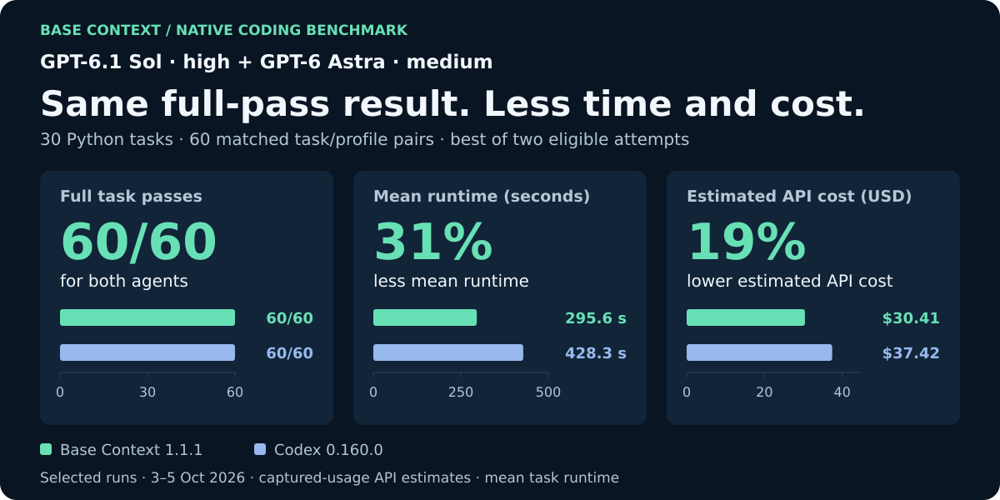
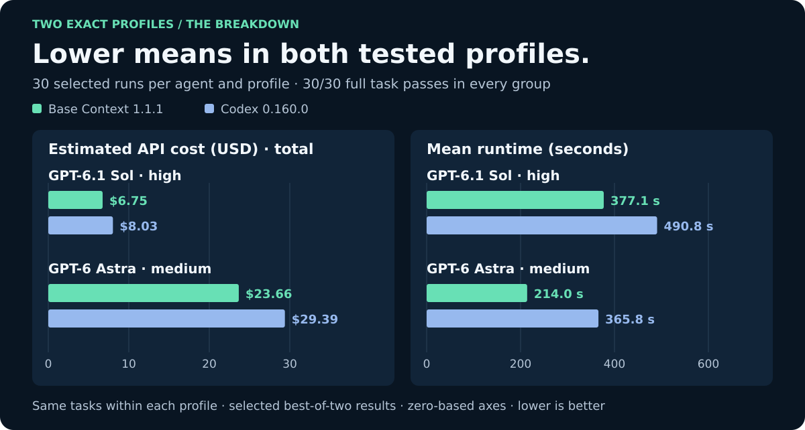
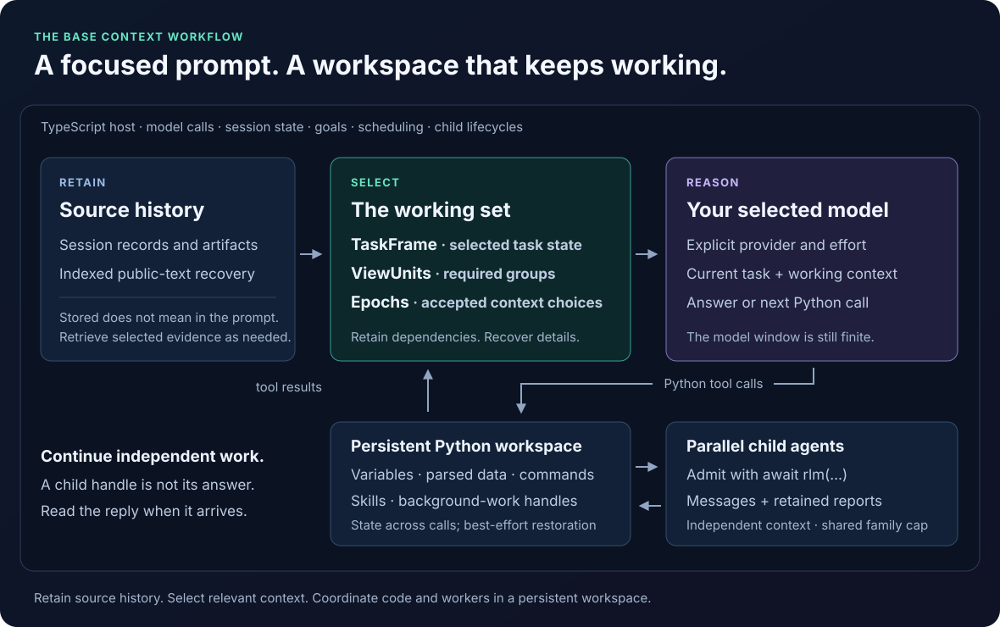

# Synerise Base Context

**Keep the work. Focus the context.**

An open-source coding and research agent with a persistent Python workspace, parallel workers, and source-backed context. Built by [Synerise](https://synerise.com), on [Prime Agent](https://github.com/PrimeIntellect-ai/prime-agent).

## Same 60/60 success. 31% less time. 19% lower estimated API cost.

[](benchmarks/python-realworld-30/README.md)

**30 Python tasks × 2 profiles:** GPT-6.1 Sol **high** and GPT-6 Astra **medium**. Base Context **1.1.1** versus Codex **0.160.0**, using selected best-of-two runs. Time is mean task-run duration; cost is the estimated API cost of captured usage. [Results and method →](benchmarks/python-realworld-30/README.md)

**On this page:** [Install](#install) · [Work with it](#work-with-it) · [Benchmarks](#benchmarks) · [How it works](#how-it-works) · [Documentation](#documentation) · [License and thanks](#license-and-thanks)

## Install

On **macOS or Linux**:

```bash
curl -fsSL https://github.com/BaseModelAI/base-context/releases/latest/download/install.sh | bash
```

The installer offers to install missing prerequisites and prepares Node.js, `uv`, and managed Python as needed. No separate Python setup is required. Run the final PATH command it prints, then:

```bash
cd /path/to/your/project
base-context
```

Choose your provider with **`/login`**, then your model with **`/model`** and reasoning level with **`/effort`**. Provider and model selection are explicit. Use the selected provider's supported authentication route; Base Context keeps its own settings and credentials.

<details>
<summary>Prefer npm, Windows, or a source build?</summary>

For an existing Node.js/npm installation, use Node.js **22.12+ on 22.x, or 23.3+**. In Bash/Zsh:

```bash
npm install -g @ponythewhite/base-context
BASE_CONTEXT_INSTALL_UV=1 base-context
```

The first normal launch prepares managed Python; the environment flag permits installing missing `uv`. Use this route instead of the installer above.

[Windows/PowerShell, source builds, updates, rollback, and uninstall](packages/coding-agent/docs/installation.md).

</details>

## Work with it

**Coming from Codex?** Start in your repository, ask for a change, and keep project instructions in `AGENTS.md`. The main shift is how the agent works underneath: a persistent Python workspace coordinates commands, data, skills, and independent child agents. You do not need to write Python to use it.

### Give it an outcome

```text
Fix the failing parser test. Keep the public API unchanged and explain the change.
```

For work that should continue across turns, start an explicit persistent goal:

```text
/goal Implement the migration in PLAN.md and run the project checks
```

The harness keeps prompting an active goal until completion or a paused, limited, or error state. Use `/goal status`, `/goal pause`, `/goal resume`, or `/goal clear`. Add `--budget <tokens>` before the objective for a goal token budget. This is not a spending cap; child work, cached input, and auxiliary calls are outside that counter. [Goal details](packages/coding-agent/docs/long-running-agents.md#persistent-goals).

### Split independent work

```text
Delegate the API review and documentation update to separate workers.
Keep working on the parser fix, then integrate their replies.
```

**`/agents 4`** sets the concurrent subagent cap; **`/agents`** shows it. The default is four across the root family, including idle workers and pending admissions. Lowering it does not stop existing workers; `/agents 0` blocks new ones.

The slash command controls capacity. **`base-context agents`** opens the agent view; `base-context list` lists agents. Each child has its own context. The parent receives explicit replies or retained reports, not an automatic copy of every child turn.

### Ask without steering the main task

```text
/btw Why did you choose this parser?
```

`/btw` opens a separate, tool-free side conversation using the current main context. It does not add that conversation to the main session or interrupt its work. Ask follow-ups in the side pane; **Esc** returns to the main editor.

| Want to… | Use |
| --- | --- |
| Add a file or run a command | `@path`, `!command`; `!!command` keeps output out of model context |
| Steer running work / queue a later request | Enter / Alt+Enter |
| Inspect context, tokens, and cost estimates | `/context` or `/usage` |
| Summarize context / refine saved harness advice | `/compact` / `/refine` |
| Continue the latest session | `base-context -c` |
| Reattach to a resident agent | `base-context attach <agent>` |
| Stop one agent / all agents and services | `base-context stop <agent>` / `base-context shutdown` |

Normal interactive sessions keep running after the terminal detaches. Save important outputs in files; kernel restoration is best-effort. [Full usage](packages/coding-agent/docs/usage.md) · [Background work and schedules](packages/coding-agent/docs/long-running-agents.md).

## Benchmarks

[](benchmarks/python-realworld-30/README.md)

| Across the 60 task/profile pairs | Base Context 1.1.1 | Codex 0.160.0 |
| --- | ---: | ---: |
| Full task passes | **60/60** | **60/60** |
| Selected captured API-cost estimate | **$30.41** | $37.42 |
| Mean selected-run duration | **295.6 s** | 428.3 s |
| Lower estimated cost, paired tasks | **55/60** | 5/60 |
| Shorter duration, paired tasks | **55/60** | 5/60 |

**Method in brief:** the same 30 tasks, two matched model/effort profiles, the same task checks, and best-of-two selection for both tools. Each tool uses its native instructions, tools, and context management. The linked methodology gives the run settings and selection rules behind these results.

[Per-task chart](packages/coding-agent/docs/images/benchmarks/benchmark-task-pairs.svg) · [Selection rules, execution settings, and full results](benchmarks/python-realworld-30/README.md).

## How it works

**Keep a notebook. Work from a clear desk.** Retained history is the notebook; the model's working context is the desk. Base Context keeps those separate, so the next request need not carry every previous output. When a summary is not enough, the agent can recover selected original public text.



### Three ideas, one workflow

- **Program, rather than repeat.** The Python kernel keeps variables, parsed data, and command handles across tool calls. The agent uses each project's own environment for its commands. Skills expose reusable Python functions instead of requiring a separate model tool for every operation.
- **Select context, retain evidence.** A **TaskFrame** carries selected goals, constraints, and open work. Dependency-aware **ViewUnits** keep required calls and results together. Indexed history recovery retrieves bounded source text; **context epochs** keep accepted context choices stable.
- **Delegate without losing the thread.** `await rlm(...)` admits a child and returns a handle, not its answer. Workers run independently. Messages and retained reports bring their findings back; the parent can continue unrelated work meanwhile.

The TypeScript host owns model calls, sessions, goals, scheduling, and child lifecycles. Python is the agent's control environment, not a second agent engine. Recognized transient provider errors can recover within the same invocation without replaying completed tools, subject to cancellation and configured limits.

### Different from Codex. Built on Prime Agent.

**For Codex users:** Base Context offers a Python-first execution model, explicit persistent goals, configurable worker capacity, and indexed recovery of retained public history. Provider/model selection is yours.

**From Prime Agent:** the persistent Python REPL, recursive delegation, skills, messaging, goals, and long-running sessions are the foundation we inherited. Base Context's focus is the source-backed working-set architecture around them: framed history, TaskFrames, dependency-aware selection, stable epochs, and native recovery. It also owns its CLI, runtime distribution, and `~/.base-context` state.

Explore the working-set architecture, history recovery, and SDK controls in [Context design](packages/coding-agent/docs/context-management.md) · [Fork philosophy](packages/coding-agent/docs/fork-philosophy.md).

**Run trusted work.** Python and project commands use your user permissions. Use an external sandbox for untrusted code. See [security guidance](SECURITY.md).

## Documentation

[Quickstart](packages/coding-agent/docs/quickstart.md) · [Usage](packages/coding-agent/docs/usage.md) · [Settings](packages/coding-agent/docs/settings.md) · [Providers](packages/coding-agent/docs/providers.md) · [Skills](packages/coding-agent/docs/skills.md) · [RLM](packages/coding-agent/docs/rlm.md) · [SDK](packages/coding-agent/docs/sdk.md) · [All docs](packages/coding-agent/docs/index.md)

See the [changelog](CHANGELOG.md) for releases. Contributions are welcome: [CONTRIBUTING.md](CONTRIBUTING.md).

## License and thanks

[MIT](LICENSE), with upstream notices preserved in [NOTICE](NOTICE).

**Prime Agent is an excellent foundation, and we are grateful to its authors.** Thank you to [Prime Intellect](https://github.com/PrimeIntellect-ai/prime-agent) for the Python-first agent and recursive runtime, and to [Mario Zechner's Pi](https://github.com/badlogic/pi-mono), on which Prime Agent builds. Base Context is an independent fork by Synerise, not an official Prime Intellect release.
