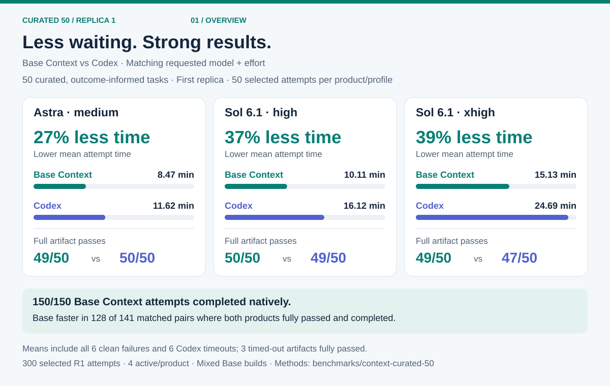
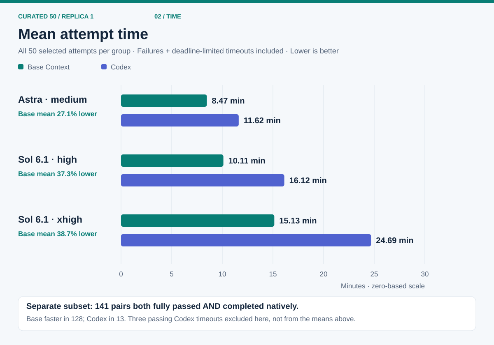
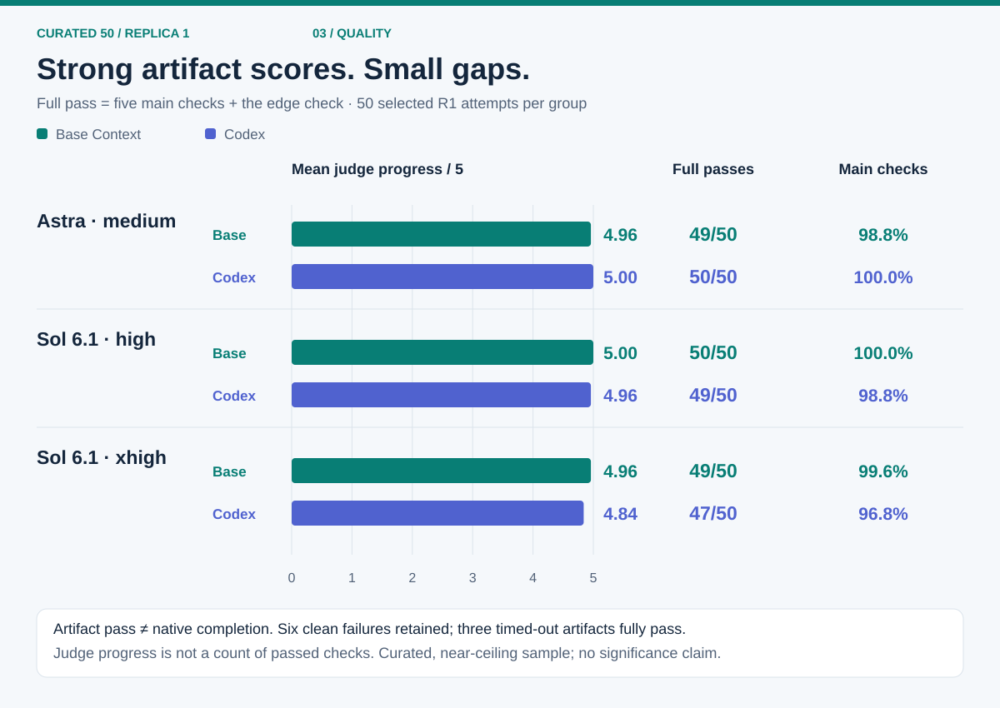
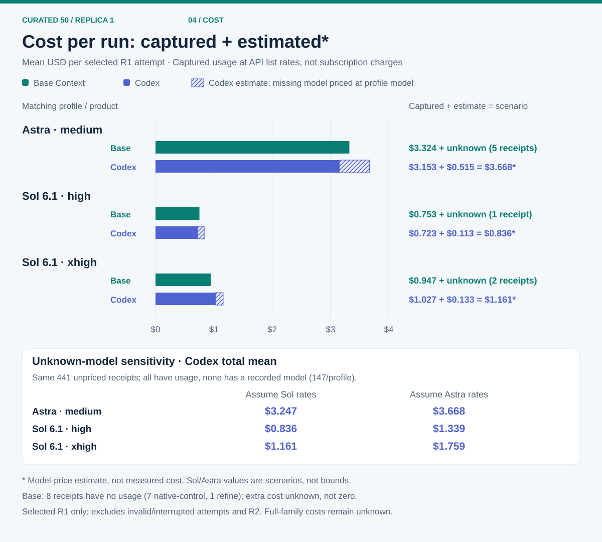

# Curated 50 — first replica



**Less time on these workflows, with strong artifact scores.** Base Context's mean attempt time was **27.1%, 37.3% and 38.7% lower** than Codex's at the three matching model/effort profiles. Full artifact passes were **148/150 vs 146/150**. These are descriptive results on a curated, outcome-informed task set, not evidence of general superiority or a particular mechanism's effect.

This page reports **R1 only: 50 tasks × 3 profiles × 2 products = 300 selected attempts**, 50 per group. It retains all six clean failures and all six native timeouts. R2 was stopped by the user and remains archival; it is not a primary or best-of-two result. Costs below are incomplete captured-usage subtotals, with hypothetical additions clearly separated.

[Machine-readable summary](summary-replica1.json) · [Time](#mean-attempt-time) · [Quality](#artifact-quality) · [Cost](#cost-known-subtotals-and-model-price-hypotheses) · [Methods](#methods-and-limits) · [Reproducibility](#reproducibility)

## Mean attempt time



| Requested model / effort | Base Context mean | Codex mean | Base mean reduction |
| --- | ---: | ---: | ---: |
| `gpt-6-astra` / medium | 508.43 s (8.47 min) | 697.18 s (11.62 min) | 27.1% |
| `gpt-6.1-sol` / high | 606.40 s (10.11 min) | 967.36 s (16.12 min) | 37.3% |
| `gpt-6.1-sol` / xhigh | 908.06 s (15.13 min) | 1,481.28 s (24.69 min) | 38.7% |

The primary time measure is the arithmetic mean of **all 50 selected attempt durations per group**, from first prompt through native attempt termination. It includes staged work, compaction/reopen time, clean failures and deadline-limited timeouts. Preparation/startup and post-run judging are outside this elapsed-time measure. Reduction is `1 − Base mean / Codex mean`, not an average of task-level speed ratios or a throughput result.

**A different, descriptive subset:** 144 matched task/profile pairs fully passed artifact judging on both products. In 141 of these, both native attempts also completed. Base was faster in **128 pairs**, Codex in **13**, with no ties. The other three pairs had passing Codex artifacts but a native timeout. Those three are excluded only from this completed-pair comparison, **not** from the primary means. This subset is not a 128/150 win claim.

## Artifact quality



| Model / effort | Product | Full artifact passes | Mean judge progress / 5 | Main-check accuracy | Native completed |
| --- | --- | ---: | ---: | ---: | ---: |
| Astra / medium | Base Context | 49/50 (98%) | 4.96 | 98.8% | 50/50 |
| Astra / medium | Codex | 50/50 (100%) | 5.00 | 100.0% | 50/50 |
| Sol 6.1 / high | Base Context | 50/50 (100%) | 5.00 | 100.0% | 50/50 |
| Sol 6.1 / high | Codex | 49/50 (98%) | 4.96 | 98.8% | 50/50 |
| Sol 6.1 / xhigh | Base Context | 49/50 (98%) | 4.96 | 99.6% | 50/50 |
| Sol 6.1 / xhigh | Codex | 47/50 (94%) | 4.84 | 96.8% | 44/50 |

- **Full artifact pass:** all five main checks and the edge check pass. This does not require native completion.
- **Mean judge progress:** average judge-reported `progress_level`, on a 0–5 scale. It is not the average number of passed checks. For example, F06 Base/xhigh passed four main checks but not its edge check and received progress 3.
- **Main-check accuracy:** passed main checks divided by 250 per group. Edge checks are not included in this percentage.

The scores are near ceiling. The small gaps are descriptive; no significance or population-level claim is made.

### Failures and timeouts stay visible

All six provider-clean artifact failures remain in the reported groups. None was rerolled for quality.

| Adaptive task | Product / profile | Native status | Main checks | Edge | Progress / 5 |
| --- | --- | --- | ---: | --- | ---: |
| F06 | Base / Sol xhigh | completed | 4/5 | fail | 3 |
| I09 | Codex / Sol xhigh | timeout | 0/5 | pass | 1 |
| AB28 | Codex / Sol xhigh | timeout | 4/5 | fail | 3 |
| AG33 | Base / Astra medium | completed | 2/5 | pass | 3 |
| AG33 | Codex / Sol high | completed | 2/5 | pass | 3 |
| AT46 | Codex / Sol xhigh | timeout | 3/5 | fail | 3 |

All **six native timeouts** were Codex/Sol xhigh: I09, Y25, AB28, AD30, AT46 and AW49. Y25, AD30 and AW49 fully passed artifact checks at the deadline. I09 had a 5,400-second deadline; the other five had 2,700 seconds. Observed durations are about 0.1 seconds beyond these deadlines. Their available artifacts were judged without converting a timeout into native completion. The failure and timeout counts overlap; they are not twelve distinct failed attempts.

## Cost: known subtotals and model-price hypotheses



**No complete-cost or invoice claim.** These subscription-route runs are valued at the recorded API list rates. Solid bars show the measured-known component: captured usage that could be priced. They are not actual subscription cash charges. Unpriced receipts remain unknown, not zero. Full-family capture is not established for either product.

### Measured-known component

| Model / effort | Base known mean USD | Base priced / captured receipts | Codex known mean USD | Codex priced / captured receipts |
| --- | ---: | ---: | ---: | ---: |
| Astra / medium | $3.324 | 3,778 / 3,783 | $3.153 | 2,622 / 2,769 |
| Sol 6.1 / high | $0.753 | 3,987 / 3,988 | $0.723 | 2,907 / 3,054 |
| Sol 6.1 / xhigh | $0.947 | 4,230 / 4,232 | $1.027 | 3,208 / 3,355 |

**Base also has missing pricing:** eight receipts (5/1/2 across these profiles) have known models but no usage values: seven `native-control` and one `refine`. Their additional dollar amount cannot be estimated from the captured usage. It is not included in the solid bars and is **not zero**.

**Codex has 441 unpriced receipts, 147 per profile. All have usage; all lack a recorded model.** Their purpose is not established either. Missing-model receipts must not be described as verified same-model, compaction-only or a known auxiliary model. A matching requested root model does not establish auxiliary-model parity or verified backend identity.

### Main hypothesis: missing Codex model = requested profile model

The hatched segments price unknown-model usage as if it came from the requested model for that profile. This is a **hypothesis**, not recovered measurement. The denominator remains 50 selected attempts per group.

| Model / effort | Known mean USD | Hypothetical missing mean USD | Hypothetical total mean USD | Addition over known subtotal |
| --- | ---: | ---: | ---: | ---: |
| Astra / medium | $3.153 | +$0.515 | $3.668 | 16.3% |
| Sol 6.1 / high | $0.723 | +$0.113 | $0.836 | 15.6% |
| Sol 6.1 / xhigh | $1.027 | +$0.133 | $1.161 | 13.0% |

Across the 150 Codex attempts, the known subtotal is $245.134. The same-model hypothesis adds $38.074. Neither this addition nor the resulting scenario makes family-spend coverage complete. Base's unknown component still prevents a complete-cost comparison.

### Sensitivity: price the same missing usage as Sol or Astra

Only the unknown-model component changes. The measured-known component stays fixed.

| Codex profile | Total mean if missing receipts use Sol rates | Total mean if missing receipts use Astra rates |
| --- | ---: | ---: |
| Astra / medium | $3.247 | $3.668 |
| Sol 6.1 / high | $0.836 | $1.339 |
| Sol 6.1 / xhigh | $1.161 | $1.759 |

Across all 441 receipts, the hypothetical missing component is $17.033 at Sol rates or $93.131 at Astra rates. **These are model-price scenarios, not statistical intervals or bounds on real cost.** The unknown model could be neither one.

The [recorded pricing table](../python-realworld-30/native/pricing-metadata.json), dated 2026-10-03, uses USD per million tokens:

| Assumed model | Ordinary input | Cache read | Cache write | Output |
| --- | ---: | ---: | ---: | ---: |
| `gpt-6.1-sol` | $2 | $0.10 | $2.50 | $10 |
| `gpt-6-astra` | $10 | $1 | $12.50 | $50 |

For each unknown-model Codex receipt, the hypothesis computes:

```text
ordinary_input = input_total − cache_read − cache_write
USD = (ordinary_input × input_rate + cache_read × cache_read_rate
       + cache_write × cache_write_rate + output × output_rate) / 1,000,000
```

It assumes standard tier (multiplier 1). Reasoning output is already included in output and is not added again. All 441 receipts have zero cache-write tokens and input below the 272,000-token long-context threshold, so no long-context modifier applies. Token aggregates and unrounded scenario amounts are in the JSON summary. These assumptions do not establish actual billing tiers.

Selected-attempt subtotals exclude provider-invalid attempts, parent interruptions and archival R2. They are **not total campaign expenditure**.

## Methods and limits

### Task selection and staged work

The set consists of five existing [Context Stress 5](../context-stress-5/) tasks plus 45 adaptive workflow candidates that had provider-clean Codex passes on both earlier profiles. Selection was explicitly outcome-informed, then frozen before these fresh runs. It is not a random sample, an unseen holdout or a set of 50 demonstrated Base advantages. Earlier candidate outcomes remain historical; W23 was not qualified, and AL38/AN40 remained on authoring-contract holds.

Both products received the same task information, fixtures, judges, stage treatment and task/profile configuration. The tasks include staged workflow updates, scheduled native compaction and cold reopening of the persisted native session with the workspace intact. Deadlines do not reset at compaction or reopening.

| Tasks | Stages | Compact after stages | Cold reopen after stage | Deadline |
| ---: | ---: | --- | ---: | ---: |
| 5 Stress5 | 6 | 2, 4 | 4 | 2,700 s |
| 35 adaptive | 16 | 4, 8, 12 | 8 | 2,700 s |
| 6 adaptive | 14 | 4, 8, 12 | 8 | 2,700 s |
| 1 adaptive | 14 | 4, 8, 11 | 8 | 2,700 s |
| 1 adaptive | 12 | 3, 6, 9 | 6 | 2,700 s |
| 1 adaptive (F06) | 20 | 4, 8, 12, 16 | 12 | 5,400 s |
| 1 adaptive (I09) | 22 | 4, 8, 12, 16 | 12 | 5,400 s |

These are scheduled interventions, not evidence that every timed-out attempt reached every stage. The result does not isolate output retention, instruction pinning, delegation or any recovery mechanism as a cause.

### Native settings, resources and timing

- Requested profiles: `gpt-6-astra`/medium, `gpt-6.1-sol`/high and `gpt-6.1-sol`/xhigh, through the existing ChatGPT subscription route.
- Rolling paired admission: at most **8 active physical attempts globally, 4 per product**, through collection. The leading product alternated by frozen pair order. There was no batch-completion barrier. Concurrency was not a 12-vs-24 comparison.
- Each attempt had 2 CPU and 8 GiB container limits. Forty-eight tasks had 2,700-second deadlines; F06/I09 had 5,400 seconds.
- Native tools, shell commands, SQL, filesystem notes, redirected output and optional delegation were allowed. Base used its frozen websocket-cached settings, up to two children and depth one; Codex retained its native sandbox/default-child settings.
- **`requestTokenBudget` was omitted.** Budgeted request-view selection was not enabled or measured here.
- Matching tasks and requested profiles do **not** establish architecture, tool, auxiliary-model, delegation or native-lifecycle parity. Base's family barrier and Codex's observed root/descendant idle state have different semantics. Cold reopen uses each product's own persistence implementation.

### First provider-clean selection, not quality selection

R1 admitted **380 physical attempts**:

| Disposition | Base Context | Codex | Total |
| --- | ---: | ---: | ---: |
| Selected provider-clean R1 attempts | 150 | 150 | 300 |
| Provider-invalid physical attempts | 72 | 4 | 76 |
| Parent-interrupted physical attempts | 2 | 2 | 4 |

An observed provider/transport error invalidated the whole physical attempt, including an eventual recovered pass. Its evidence and captured usage stayed in the private campaign record. Explicit replacements used the same cell and deadline. The **first provider-clean attempt** was selected; clean quality failures and clean native timeouts were not rerolled. “Provider-clean” means no qualifying error was observed, not proof that all provider behavior was identical. Conditioning on clean attempts excludes the 76 invalid attempts from headline quality/time and selected cost, so this is not an unconditional reliability or all-in operational-cost result.

R1 has 294 full artifact passes and six clean failures. The user stopped R2 after R1 was complete; the campaign is on user-stop hold with no running or outstanding work. No R2 selection or best-of-two value enters this publication.

### Actual builds, not a single-build claim

| Product | Observed identity | Selected R1 attempts |
| --- | --- | ---: |
| Base Context | `31d7827b0ab8a57e9c09e6b6f66661793c1e550a` | 24 |
| Base Context | `694414adbd29908d753c1d90fc7bb82cdc674456` | 126 |
| Codex | `0.160.0` | 150 |

An asynchronous frame decode/close ordering defect triggered a stop. At the user's direction, completed valid results were retained and only unfinished cells continued after the fix. No recorded completed result is established to have been affected; this does not prove old-build immunity. This is an explicit **multi-build continuation**, not a clean-slate restart or a measurement of only the new release source. The build change is another limit on attribution.

## Reproducibility

This directory supplies the aggregate [R1 summary](summary-replica1.json), this method description and a standard-library SVG renderer. The five existing Stress5 inputs and judges are public in the adjacent directory. **The 45 adaptive corpora, full frozen runtime configs, native raw records and controller artifacts are not supplied here. This is not a complete public rerun package.** No benchmark was rerun to prepare these publication assets.

Aggregates were taken from the private campaign's `matched-summary-collection175.json` and `matched-completion-summary-collection175.json`, filtered to R1. Per-record cost metadata was consulted for Base's eight missing-usage receipts. The publication does not copy corpora, raw runs, credentials or private host paths. The archived campaign retains non-selected attempts and earlier outcomes, but this page does not promise public access to those records.

Rebuild only the four charts, without dependencies or provider access:

```bash
python3 benchmarks/context-curated-50/render_charts.py
```

The renderer reads only `summary-replica1.json` and writes `packages/coding-agent/docs/images/benchmarks/curated50-{overview,time,quality,cost}.svg`. It does not collect, judge or reprice runs. All bar axes start at zero; labels are rounded for display, while the JSON keeps unrounded aggregates. The cost hatching denotes an assumption, not additional measured coverage.
