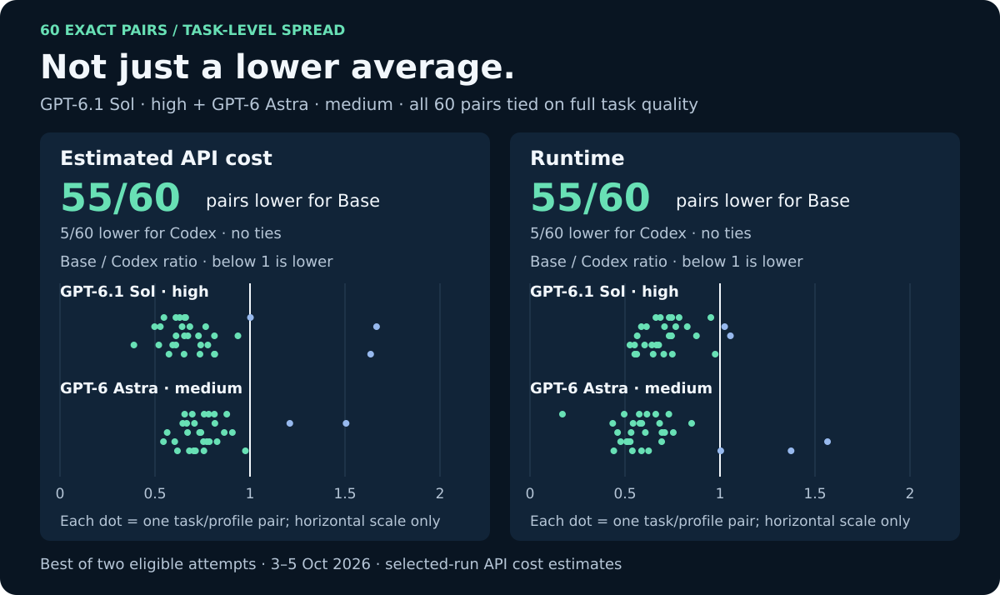

# Python Real-World 30: Base Context vs Codex

**GPT-6.1 Sol · high and GPT-6 Astra · medium only.** 30 Python tasks,
60 exact task/profile pairs. Historical Base Context **1.1.1** vs vanilla Codex **0.160.0**; these are not measurements of later source changes.

| Selected-run result | Base Context | Codex |
| --- | ---: | ---: |
| Full task passes | **60/60** | **60/60** |
| Mean runtime | **295.58 s** | 428.30 s |
| Estimated API cost, total | **$30.41** | $37.42 |
| Lower-cost task/profile pairs | **55/60** | 5/60 |
| Shorter-runtime task/profile pairs | **55/60** | 5/60 |

That is **31% less mean runtime** and **19% lower estimated API cost** for these
selected runs, with the same full-pass result. Both percentages compare aggregate totals or means. Costs cover selected runs
only, excluding unselected candidates and replacement runs that were not selected.

## By profile

| Exact model / effort | Full passes, Base / Codex | Estimated API cost, Base / Codex | Mean runtime, Base / Codex |
| --- | ---: | ---: | ---: |
| GPT-6.1 Sol · high | 30/30 · 30/30 | $6.75 / $8.03 | 377.11 s / 490.77 s |
| GPT-6 Astra · medium | 30/30 · 30/30 | $23.66 / $29.39 | 214.04 s / 365.83 s |

## Method in brief

- The same [30 tasks](tasks.json), staged fixtures and external deterministic
  judges apply to both agents. Each exact model/effort profile uses every task.
  Each attempt starts in a fresh isolated workspace and follows the task's 1–5 stages.
- **Best of two:** each agent/task/profile cell has two eligible candidates:
  **240 candidates, 120 selected runs, 60 pairs**. Select from the first two
  eligible attempts by completion, full judge pass, progress level, main checks
  passed, edge check passed, lower estimated API cost, shorter runtime, then
  earlier physical attempt. Quality comes before cost and time.
- Attempts with observed external provider/transport errors are excluded and
  replaced. Clean task failures and timeouts stay eligible. There are no
  score-driven retries. Eligibility screening uses the saved native evidence.
- A full pass means judge status `pass` and progress level 5/5. All selected
  runs also pass all main checks and the edge check.
- Runtime runs from the first prompt to native exit or termination. Preparation,
  startup, grading and later collection are outside this clock. The reported mean is per selected task run.
- Costs price captured native requests with the frozen **3 October 2026**
  [API rate catalog](native/pricing-metadata.json). They are **estimates, not
  invoices**, subscription charges or guaranteed full-family spend. Unknown
  usage is not zero. Only explicitly cancelled receipts use reporting cost zero;
  none occur in this selected cohort. Unspecified service tiers assume standard
  rates; recorded tier and long-input modifiers remain in effect.

## Recorded controls

| Control | Base Context | Codex |
| --- | --- | --- |
| Product | 1.1.1, clean source `22f815fbf324ca4df1a886c8e71c819d765caba1` | Official native CLI / app-server 0.160.0 |
| Dates, UTC | 5 Oct 2026 | Original 3–4 Oct; replacements 5 Oct 2026 |
| Original shared-campaign concurrency | Observed 24 total; 4 tasks/profile | Observed 12 total; 2 tasks/profile |
| Targeted replacements | None in this scope | Shared seven-slot scheduler |
| Context, both profiles | 272,000 tokens; 258,400 usable (95%); trigger 244,800 (90%) | Same nominal limits |
| Task deadlines | 2× original: 1,200 / 1,800 / 2,400 / 3,600 seconds | Same limits |

Concurrency describes the shared campaigns, not a standalone two-profile run.
Each product keeps its native instructions, tools and context management.
These results describe the saved runs under the settings above; dates,
concurrency and captured-usage coverage differ between the tools.

## What this comparison does not establish

The tasks are self-authored standard-library applications. Both tools reach 60/60 selected passes, so this sample has a quality ceiling. Best-of-two selection and exclusion of provider failures do not measure single-attempt reliability. Differences in dates, concurrency, and native tools prevent attributing the observed timing or cost difference to a single feature.

The Base runs **did not enable request-budget selection**. This is not an ablation of selection, a measurement of later fixes, or a test of long-session recall, post-compaction instruction recovery, or delegation quality. Those need separate, appropriately designed evaluations. Selected captured estimates also exclude losing or rejected runs and are not complete campaign spend.

## Data and reproduction

- [60-pair CSV](results/task-profile-pairs.csv): selected task outcomes, estimated
  API costs and runtimes. No private paths, sessions or raw provider payloads.
- [Summary JSON](results/summary.json): exact metrics, profiles and selection parameters.
- [Reproduction guide](REPRODUCE.md): regenerate these charts offline, or use the
  retained native single-attempt harness for a separately labeled new experiment.

The checked-in tasks, fixtures and judges remain available. The native harness
is a reusable single-attempt scaffold, not the exact private campaign controller.
