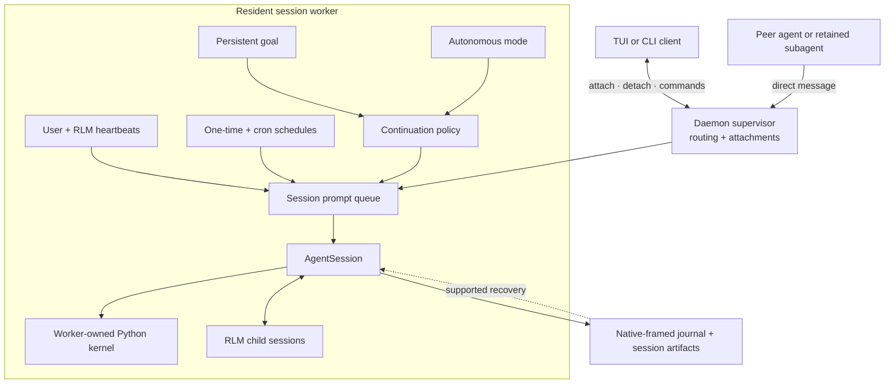

# Long-Running and Background Agents

Base Context combines daemon-backed session workers with persistent state, scheduled prompts, direct agent messaging, goals, and bounded autonomous continuations. These features serve different purposes but share the same session and worker runtime.

## Runtime Flow



The client can detach at any point. The resident worker continues to own the queue, schedules, session, kernel, descendants, and persisted state.

## Daemon-Backed Sessions

Normal interactive sessions run in resident worker processes managed by a local supervisor. The worker owns the root session, its Python kernel, scheduled jobs, and RLM descendants.

Closing the terminal UI detaches the client; it does not stop the worker. List and reconnect to active agents with:

```bash
base-context list
base-context attach <agent>
```

Other lifecycle commands are:

```bash
base-context agents                 # Open the agents view
base-context rename <agent> <name>   # Give an agent a stable readable name
base-context stop <agent>            # Stop one agent
base-context status                 # Inspect background services
base-context doctor [--fix]          # Diagnose or repair service state
base-context shutdown [--force]     # Stop all agents and services
```

Workers persist native-framed journals and use derived indexes. The default flat paths are `~/.base-context/sessions/<session-id>.jsonl` and `~/.base-context/session-artifacts/<session-id>/`. `BASE_CONTEXT_HOME` selects the product root; `BASE_CONTEXT_SESSION_DIR` can select a different absolute sessions directory, with artifacts under its parent's `session-artifacts/` directory.

The `.jsonl` extension does not make a native journal an editable transcript. Use the asynchronous, bounded SessionManager APIs described in [Sessions](sessions.md#session-format), not `jq`, manual appends or text edits. Recovery uses the native owners and supported artifacts. Copying a journal alone does not restore a worker, Python process, live children or pending dispatch authority.

Daemon workers are process-isolated for lifecycle and failure containment, not security-sandboxed. They normally run with the same operating-system permissions as the client.

## Agent-to-Agent Communication

The daemon routes direct messages between active sessions and retained daemon-backed subagents. From a shell:

```bash
base-context send <agent> "Please verify the latest migration"
```

From the Python kernel, use the preloaded `agent_message` Python skill:

```python
roster = await agent_message.list_agents()
receipt = await agent_message.send(
    "Recheck the endpoint after the latest edit",
    receiver_role="sibling",
    receiver_name="api-reviewer",
    mode="auto",
)
print(receipt["deliveryStatus"])
```

For the current parent's direct RLM children, prefer the parent-scoped registry:

```python
children = await rlm.list_subagents()
child = next(item for item in children if item.session_name == "api-reviewer")
await agent_message.send(
    "Continue with the updated diff",
    receiver_role="child",
    receiver_name=child.session_name,
)
```

Delivery modes are:

- `auto`: steer a busy target and deliver immediately to an idle target;
- `steer`: intentionally inject the message into active work; and
- `follow_up`: wait until the target's current work finishes.

A receipt is `delivered` when it reached an idle target's context or `queued` when accepted for later delivery. `agent_message.send("all", message)` broadcasts only within the family roster. The daemon derives sender identity and enforces message-size, rate, and pending-queue limits.

## Heartbeats and Scheduled Prompts

Base Context has three related scheduling surfaces:

| Surface | Owner | Purpose |
|---|---|---|
| `/heartbeat` | User | One visible recurring instruction for the current session. |
| `rlm_heartbeat` | Agent | Multiple programmatically managed recurring instructions internal to the current session. |
| `base-context schedule` | User or automation | General one-time or cron prompts targeted at an agent. |

### User heartbeat

Create and manage the current session's visible heartbeat:

```text
/heartbeat every 10m Check the deployment and report meaningful changes
/heartbeat status
/heartbeat pause
/heartbeat resume
/heartbeat clear
```

Heartbeat delivery defaults to steering active work. Add `--follow-up` when the recurring prompt should wait until the current turn finishes. Use `/heartbeats` to inspect and manage both user and agent-created heartbeats.

### Agent-created RLM heartbeats

An agent can create several internal heartbeats programmatically:

```python
first = await rlm_heartbeat.create(
    "check whether the test run finished",
    interval="5m",
    label="tests",
)
second = await rlm_heartbeat.create(
    "inspect the deployment status",
    interval="10m",
    label="deploy",
    delivery_mode="follow_up",
)

await rlm_heartbeat.list()
await rlm_heartbeat.update(first["heartbeat"]["id"], status="pause")
```

RLM heartbeats are distinct from the user's `/heartbeat`; the Python skill cannot replace or clear the user-owned heartbeat.

### General schedules

Schedule a one-time or recurring prompt for an addressable agent:

```bash
base-context schedule add worker "in 30m" -- "Check the benchmark result"
base-context schedule add worker "0 9 * * 1-5" -- "Review open work"
base-context schedule list --all
base-context schedule cancel <job-id>
```

Scheduled jobs are persisted per session and continue while the UI is detached. Due ticks are claimed before delivery so a crash does not replay an uncertain prompt, and missed ticks are coalesced rather than accumulated into an unbounded backlog.

### Schedules retained by offline migration

The [offline-root importer](sessions.md#importing-an-offline-prime-root) can retain uniquely matched top-level cron jobs, the user heartbeat, and recurring RLM heartbeats. It creates **paused** records in each new session's `scheduled-jobs.json`, with new job IDs and mapped destination session IDs, journal paths and cwd. It does not copy pending dispatches, the old active-session identity or `nextRunAt`.

List imported schedule metadata without starting or connecting to a daemon:

```bash
BASE_CONTEXT_HOME=/new/base-context-home base-context schedule list --offline --json
```

The offline list omits retained instructions, labels and schedule-expression text. Retained text stays in the file as unexecuted data; it is not secret-scrubbed. Old run errors are not imported. Opening or listing an imported session does not resume its schedules.

After the new session is actually bound to its normal runtime, use the existing heartbeat controls. For an RLM heartbeat, list the new IDs in that session, choose one, then explicitly resume it:

```python
await rlm_heartbeat.list()
await rlm_heartbeat.update("<new-heartbeat-id>", status="resume")
```

Old job handles and Python/kernel state are not restored. Subagent or nonzero-depth owners, ambiguous/unmatched targets and one-shot RLM heartbeats are unsupported. Generic cron resume is not added by migration; a one-shot cron job needs explicit rescheduling. See the import limits in [Sessions](sessions.md#importing-an-offline-prime-root).

## Persistent Goals

A goal is a durable objective that the harness continues to present across turns until it is complete, paused, budget-limited, errored, or cleared. Start one explicitly from the TUI:

```text
/goal Ship the release and verify every published artifact
/goal --budget 200000 Complete the repository migration
```

Manage its state with:

```text
/goal status
/goal pause
/goal resume
/goal clear
```

The model uses the kernel-side `goal` skill to inspect or finish the objective:

```python
state = await goal.get()
await goal.complete()
```

Goal state records token usage, elapsed time, continuation count, and an optional explicit token budget. The harness keeps prompting an active goal after ordinary assistant turns; only `goal.complete()` marks successful completion. Creating a persistent goal is an explicit user or host action, not something the agent should infer from every task. Imported historical goal entries remain retained data; importing them does not reactivate the goal.

## Autonomous Mode

Autonomous mode is a bounded host policy for runs where no human input is expected. Base Context adds follow-up continuations until configured quality gates pass or a continuation, turn, token, or wall-clock limit is reached.

Enable it in an interactive session:

```text
/autonomous on
/autonomous status
/autonomous off
```

Or configure a run from the CLI:

```bash
base-context \
  --autonomous \
  --autonomous-gate "npm run check" \
  --autonomous-max-turns 20 \
  "Implement and verify the requested change"
```

Autonomous mode supports limits for continuations, assistant turns, tokens, and wall-clock duration. Gate commands run before the session may finish; a failed gate returns its bounded output to the agent for another attempt. Base Context avoids rerunning the same failed gate when the workspace has not changed.

Goals and autonomous mode are complementary but different:

- a **goal** stores the objective and its progress state across turns;
- **autonomous mode** decides whether to inject another continuation based on evidence, gates, and limits.

## Compaction and Continuity

Automatic compaction handles context growth during long tasks. On overflow or near the configured threshold, Base Context summarizes older messages, retains recent context, and continues. This changes the model's active context; it is not a guarantee that every Python object survives. Compaction can prune oversized variables from a running kernel. Persist important work in project files rather than relying on kernel memory or treating a session journal as a portable process snapshot.

The agent can inspect or request compaction programmatically:

```python
await compact.status()
await compact.run("Preserve the failing tests and remaining migration steps")
```

A successful compaction is not a completion signal. Goals, autonomous continuations, heartbeats and child sessions keep their own lifecycle rules; compaction alone does not mark them complete.

For lower-level process and recovery behavior, see [Daemon Architecture](daemon.md). For recursive child lifecycle details, see [RLM Programming Model](rlm.md) and [RLM Runtime Architecture](rlm-runtime.md).
